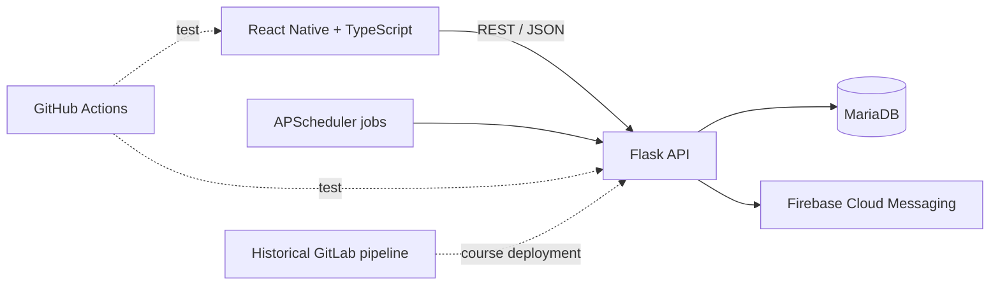

# HFXAir

[](https://github.com/beaprogram/HFXAir/actions/workflows/ci.yml)

A team-built mobile experience for Halifax Stanfield International Airport (YHZ). HFXAir combines flight lookup, an airport shop directory, reservations, JWT-protected flows, and Firebase Cloud Messaging in a React Native client and Flask API.

## Project status

HFXAir was developed as a Dalhousie course project. The application code, automated tests, GitLab pipeline definition, refactoring reports, and historical deployment documentation are present. The course database/VM deployment should be treated as historical infrastructure, not a currently supported public demo.

GitHub Actions now provides repository-level test feedback. It does not deploy the application.

## Implemented capabilities

- Browse arrivals, departures, and flight details from the configured MariaDB database.
- Authenticate using flight and ticket information and receive a JWT.
- Browse airport shops, opening hours, categories, and items.
- Create, list, and cancel item reservations.
- Subscribe devices and send Firebase push notifications.
- Run scheduled backend notification work through APScheduler.
- Exercise backend routes with pytest and the mobile shell with Jest.

Detailed user stories are in [Documentation/USER_STORIES.md](Documentation/USER_STORIES.md).

## Architecture



## Technology

| Layer | Tools |
|---|---|
| Mobile | React Native 0.82, React 19, TypeScript, React Navigation |
| API | Python, Flask, PyMySQL, PyJWT |
| Data | MariaDB |
| Notifications | Firebase Cloud Messaging, APScheduler |
| Quality | Jest, pytest, pytest-cov, historical Designite reports |
| Delivery | GitHub Actions for tests; historical GitLab/VM deployment files |

## Local setup

### Backend

Requires Python 3.10+ and access to a compatible MariaDB schema.

```bash
git clone https://github.com/beaprogram/HFXAir.git
cd HFXAir

python -m venv .venv
source .venv/bin/activate  # Windows: .venv\Scripts\activate
python -m pip install -r flask_app/requirements.txt

cp flask_app/.env.example flask_app/.env
# Fill in local database values and a strong JWT_SECRET.
python -m flask --app flask_app.app run
```

Do not reuse the historical course database credentials shown in old commits. Use a local database and rotate any credential that was previously published.

### Mobile client

Requires Node.js 20+, the React Native Android/iOS toolchain, and a Firebase client configuration for your own project.

```bash
cd frontend
npm ci
npm start

# In another terminal:
npx react-native run-android
```

Configure the API base URL in `frontend/src/services/axiosProvider.ts`. Supply your own `frontend/android/app/google-services.json`; it is ignored by Git.

## API overview

| Method | Route | Purpose |
|---|---|---|
| `POST` | `/login` | Exchange flight/ticket data for a JWT |
| `GET` | `/flights` | List flights |
| `GET` | `/flights/<id>` | Get flight details |
| `GET` | `/flights/arrivals` | List arrivals |
| `GET` | `/flights/departures` | List departures |
| `GET` | `/shops` | List airport shops |
| `GET` | `/shops/<id>/items` | List shop items |
| `GET` | `/bookings` | List the authenticated user's bookings |
| `POST` | `/bookings` | Create a reservation |
| `POST` | `/bookings/<id>/cancel` | Cancel a reservation |
| `POST` | `/subscribe` | Register for flight notifications |

## Run the checks

```bash
# Backend
python -m pip install -r flask_app/requirements.txt
pytest flask_app/tests -q

# Mobile
cd frontend
npm ci
npm run lint
npm test -- --runInBand --watchAll=false
```

Some integration scenarios require a configured database or Firebase project. Tests that need those services should use dedicated test credentials and must not connect to production or course infrastructure from pull requests.

## Repository map

```text
frontend/                 React Native application and Jest tests
flask_app/                Flask routes, helpers, and pytest suite
Documentation/            User stories, design, TDD, refactoring, and historical deployment notes
.gitlab-ci.yml             Historical course CI/CD pipeline
.github/workflows/ci.yml   Current GitHub test workflow
```

## Product evidence

The repository does not yet include reviewed product screenshots. Follow [Documentation/screenshots/README.md](Documentation/screenshots/README.md) to add mobile captures without exposing ticket numbers, tokens, Firebase identifiers, or personal information.

## Security

Read [SECURITY.md](SECURITY.md) before configuring the app. Database passwords, Firebase service-account files, JWT secrets, and access tokens must never be committed.

## License

No open-source license has been selected for this team course project. Until the contributors choose one, the code remains copyrighted by its contributors.
